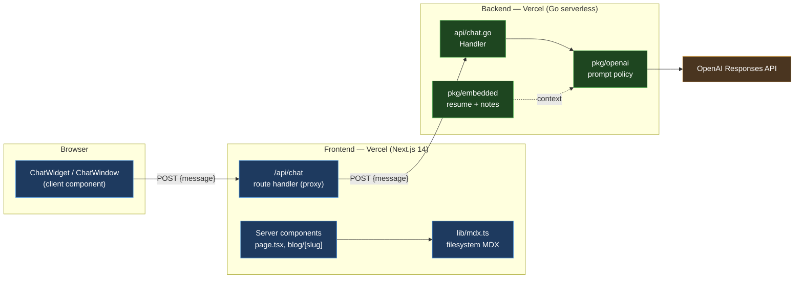
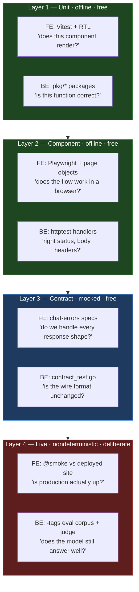
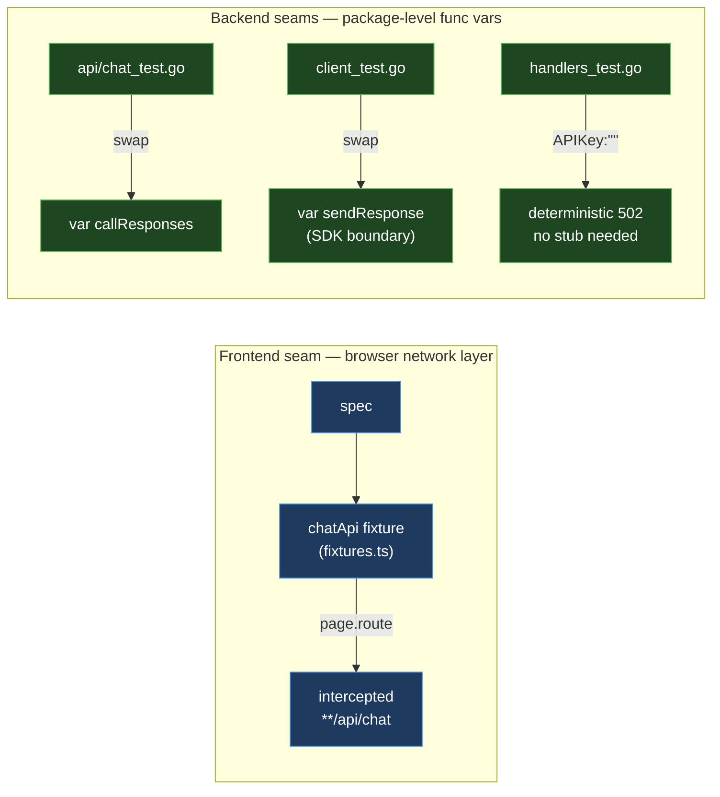
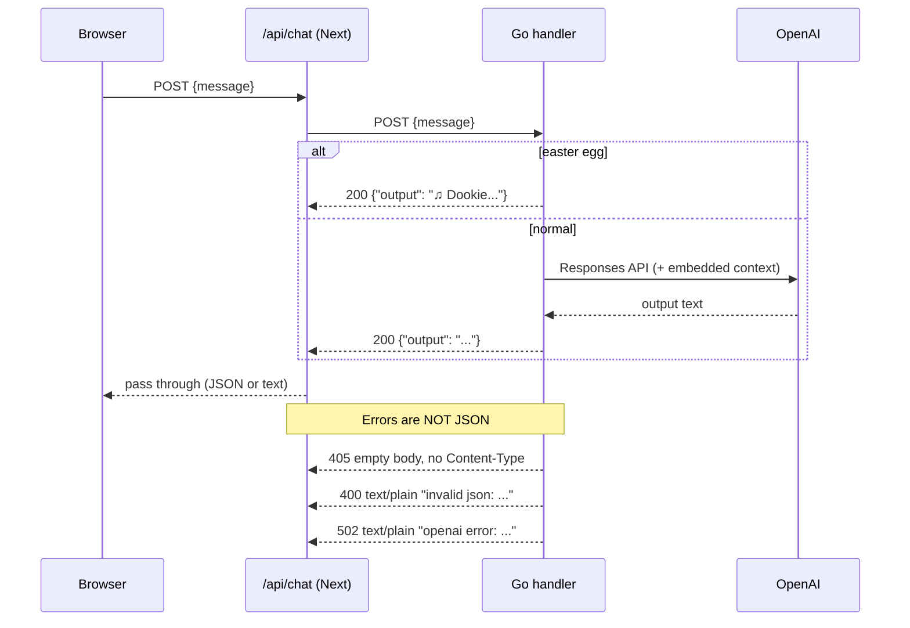
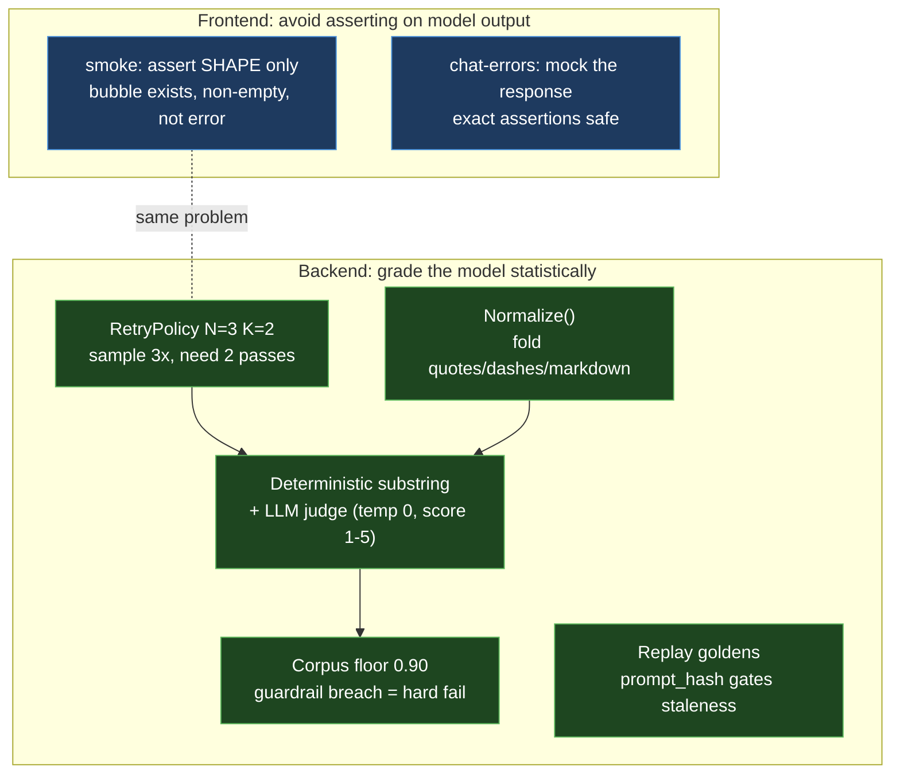
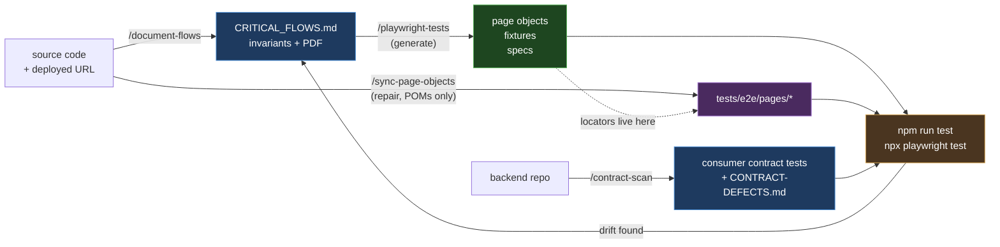
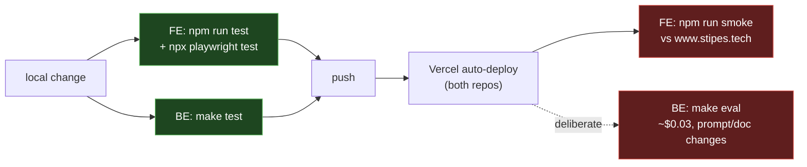

# Test Architecture — Frontend + Backend

**What** we test across the two repos behind stipes.tech, **how** each thing is
tested and why that way, and **when** to reach for the Claude skills that
generate most of it.

| | |
|---|---|
| Frontend | `stipes-nextjs-tailwind` — Next.js 14 App Router, Vitest + Playwright |
| Backend | `stipes-openai-chat` — Go 1.22, stdlib `testing` only |
| Deployed | `https://www.stipes.tech` → `https://stipes-openai-chat.vercel.app` |

Companion documents: [`CRITICAL_FLOWS.md`](CRITICAL_FLOWS.md) (frontend invariants)
and `docs/TESTING_STRATEGY.md` in the backend repo (Go layer detail).

**Start here:** new to the codebase → §1–2. Writing a test → §3–5. Want the
tooling to do it → [§6](#6-using-the-claude-skills-to-speed-up-testing).

> Read this on GitHub or in an editor with Mermaid support — the diagrams are
> the point. The PDF renders them as source, not pictures.
>
> This document describes structure, not status. Counts and pass rates live in
> the test run, not here — the one place they appear is the coverage
> thresholds, which are enforced.

---

## 1. System shape

Two independently deployed services. The browser never talks to the Go service
directly — the Next.js route handler proxies, which is what supplies CORS and
keeps the OpenAI key out of the client.



**Why the proxy exists:** the Go service sends no CORS headers at all
(`grep -rn "Access-Control"` finds nothing), so a browser could not call it
cross-origin even if we wanted it to. `/api/chat` is the boundary.

---

## 2. What we test, and how

Both repos split tests by **cost and determinism**, not by the usual
unit/integration taxonomy. The question each layer answers is different, so a
failure at each layer means something different.



| Layer | What it covers | How | A failure means |
|---|---|---|---|
| **1 Unit** | Pure logic: MDX loading, prompt building, config defaults, single components | Vitest + Testing Library / `go test` | The unit is wrong. Cheapest fix. |
| **2 Component** | A flow in a real browser; a handler over real HTTP | Playwright + page objects / `httptest` | Wiring between correct units broke. |
| **3 Contract** | Every documented response shape and failure mode at the `/api/chat` boundary | Mocked at the network seam | The producer changed, or we mis-handle a shape it always sent. |
| **4 Live** | Production is reachable and behaves; the model still answers accurately | Real network, real deploy, real model | Something outside the code changed. |

**What is deliberately *not* covered:** visual regression, cross-browser
(chromium only), load/performance, and accessibility auditing beyond the
role-based selectors the tests already depend on.

### The rule that makes the split work

**Layers 1–3 must run with no network and no API key.** That is what keeps them
usable as a pre-push gate. Both repos let you prove it rather than trust it:

```bash
env -u OPENAI_API_KEY go test ./...   # backend: no key, still green
SMOKE_BASE_URL= npm run e2e           # frontend: mocked at page.route
```

Layer 4 is the opposite by design: it exists precisely to touch the real thing,
so it never runs as a silent gate.

### Coverage thresholds

The frontend enforces **80% lines/statements/functions, 70% branches** on
`lib/**` and components (`vitest.config.mts`). These are floors that fail the
build, not targets to admire.

> ⚠️ A glob gotcha worth knowing: the route group `(site)` cannot appear
> literally in a coverage `include` pattern — Vitest's matcher treats the
> parentheses as a group and silently drops every matching file, reporting a
> confident number for a fraction of the code. Use `app/**/components/**`.

---

## 3. Test seams

Each repo isolates the expensive dependency at exactly one boundary.



**Frontend** — all mocking lives in the `chatApi` fixture; a spec that calls
`page.route()` directly fails review. The fixture is *lazy*: importing it
installs nothing, so smoke specs that never touch it intercept nothing.

**Backend** — no mocking library at all. Three hand-rolled seams:
`callResponses` (handler level), `sendResponse` (SDK level), and the elegant
one — passing `APIKey: ""` produces a real 502 through real code with zero
network, because `CallResponses` guards on the empty key before constructing a
client.

---

## 4. The wire contract

This is the highest-risk seam in the system: two independently deployed
services, no shared types, no generated client.



The contract every consumer must handle:

| Case | Status | Content-Type | Body |
|---|---|---|---|
| success | 200 | `application/json` | `{"output":"..."}` |
| non-POST | 405 | *(none)* | empty |
| malformed JSON | 400 | `text/plain; charset=utf-8` | `invalid json: …` |
| upstream failure | 502 | `text/plain; charset=utf-8` | `openai error: …` |

**Only the 200 is JSON.** Calling `res.json()` without checking status throws
on three of the four rows — which is why the frontend's error handling is
contract-tested rather than assumed. To re-derive this table yourself:

```bash
curl -i -X POST https://stipes-openai-chat.vercel.app/chat \
  -H 'Content-Type: application/json' -d '{"message":"hello"}'
```

The backend's entire success shape is **one field**:

```go
type ChatResponse struct {
	Output string `json:"output"`
}
```

### Where the two repos disagree

The frontend parses responses through an 8-key fallback chain
(`ChatWindow.tsx:62-73`): `choices[0].message.content` → `message.content` →
`answer` → `reply` → `response` → `message` → `text` → `output`.

**The backend only ever emits `output` — the 7th key.** The first six are dead
paths against this producer. That is defensible (the chain predates the Go
service and tolerates a provider swap), but it should be a deliberate choice,
not an accident:

- `docs/CRITICAL_FLOWS.md` documents the chain as a P0 invariant, and
  `chat-errors.spec.ts` has a passing test for **every** key — so the dead
  paths are locked in by tests that will never fail.
- The genuinely load-bearing behaviors are the **non-JSON error paths**, which
  both repos do test: the Go side in `contract_test.go`, the Next side in
  `chat-errors.spec.ts` (500 → error bubble, abort → error bubble).

**Recommendation:** keep the chain, but annotate it — the comment should say
*"the current producer returns `output`; the other keys tolerate a provider
swap"* so nobody "simplifies" it by deleting the one branch that fires.

### Parity testing

`TestContract_ChatParityWithVercel` boots **both** Go implementations
(`internal/handlers` and `api/chat.go`) side by side and asserts identical
status, Content-Type, and body. Its own doc comment is admirably honest about
the limit: both fail at the same empty-key check, so *prompt-level* drift is
invisible to it. That class of bug was fixed structurally instead — prompt
policy now lives only in `pkg/openai`, so the handlers cannot diverge.

---

## 5. Nondeterminism: how each side handles it

The two repos face the same problem — an LLM in the loop — and solve it
differently, appropriately.



**Frontend rule:** never assert exact text on anything live. The smoke chat
test asserts a third bubble appeared, is non-empty, and is not the red error
bubble — never *what* it says.

**Backend rule:** treat grading as sampling. Three details worth stealing:

1. **Transport errors are never grading failures.** A rate limit is recorded in
   `Result.Err`, not as a hallucination.
2. **Short-circuit once the verdict is decided** — stop sampling when K passes
   are banked or become unreachable.
3. **`prompt_hash` gates replay goldens.** Recordings carry a fingerprint of the
   prompt; when it drifts, replay tests *skip with a re-record instruction*
   rather than failing the build.

---

## 6. Using the Claude skills to speed up testing

Three skills automate the expensive, repetitive parts of this strategy. They
are **procedures, not code generators with opinions of their own** — each reads
this repo's conventions and the flows doc, so output matches what a reviewer
here would expect.

| Skill | Lives in | Turns this… | …into this |
|---|---|---|---|
| `/document-flows` | `~/Documents/claude-toolkit` (shared) | source + a deployed URL | `CRITICAL_FLOWS.md` + PDF + `@smoke` specs |
| `/playwright-tests` | `~/Documents/claude-toolkit` (shared) | the flows doc | page objects, fixtures, contract specs |
| `/sync-page-objects` | `~/Documents/claude-toolkit` (shared) | page objects + current source | repaired locators + a drift report |
| `/contract-scan` | backend repo (`.claude/`) | a consumer repo | contract tests in *its* framework + defect report |

The first three are symlinked into `~/.claude/skills/`, so they load in any
repo. `/contract-scan` is project-local to the backend and runs from there.

### Generate vs. repair

Two of these write page objects, and picking the wrong one costs work:

- **`/playwright-tests` regenerates from the spec.** Use it when the set of
  flows changed — a feature was added or removed. It rewrites page objects,
  fixtures, *and* specs, which is exactly what you want for new coverage and
  exactly what you don't want for a one-line fix.
- **`/sync-page-objects` repairs against reality.** Use it when the flows are
  the same but the DOM moved. It writes only `tests/e2e/pages/`, so
  hand-tuned specs survive untouched.

Rule of thumb: **selectors broke → repair; coverage changed → regenerate.**

### When to reach for which

| Situation | Command | Run from |
|---|---|---|
| New to the repo, need to know what matters | `/document-flows` | either repo |
| Shipped a feature that adds a user-facing flow | `/document-flows` then `/playwright-tests <flow>` | frontend |
| Removed a flow, or coverage needs regenerating | `/playwright-tests <flow>` | frontend |
| Renamed an `aria-label`, placeholder, role, or heading | `/sync-page-objects <page>` | frontend |
| Tests failing on selectors after a UI change | `/sync-page-objects` | frontend |
| Just deployed | `npm run smoke` (specs already generated) | frontend |
| Backend changed its response shape or status codes | `/contract-scan <consumer>` | backend |
| Onboarding a *new* consumer of the API | `/contract-scan <repo>` | backend |
| Changed the prompt or embedded documents | `make eval` | backend |
| Suspect docs have drifted from reality | `/document-flows <url>` | either repo |

**When *not* to:** a one-line copy change, a dependency bump, or anything where
you already know the single assertion you need. Writing one test by hand is
faster than reviewing a generated suite.

### The loop



The purple path is the cheap one: it reads source, writes only page objects, and
leaves specs alone.

**The flows doc is the spec.** `/playwright-tests` refuses to run without it —
that dependency is deliberate: tests generated from a reviewed inventory of
invariants beat tests generated from a model's guess about what matters.

### `/document-flows [url]` — write the spec

```bash
/document-flows                          # source-only
/document-flows https://www.stipes.tech  # + live verification
```

What a tester gets:

- **An invariant inventory.** Not "the chat works" but *"the launcher keeps
  `aria-label="Open Stipes bot"` because tests select on it"* and *"do not
  narrow the response fallback chain — the upstream contract is loose."*
- **Criticality ranking** (P0/P1/P2) so smoke coverage goes where failure hurts.
- **A PDF** for people who don't read repos.
- **`@smoke` specs** wired to `SMOKE_BASE_URL`.
- **Drift notes.** With a URL, it exercises each flow in a real browser and
  records where production disagrees with source rather than silently
  reconciling — that's how the duplicate-`<h1>` defect surfaced.

Re-running is idempotent; content between `<!-- manual -->` markers survives.

### `/playwright-tests [flow|all]` — generate the suite

```bash
/playwright-tests        # whole suite
/playwright-tests chat   # one flow
```

The parts a tester would otherwise hand-write:

1. **Page objects** with locators verified against a live accessibility tree
   (Playwright MCP if configured, otherwise `claude-in-chrome`, otherwise a
   throwaway headless spec asserting `toHaveCount(1)`).
2. **Typed fixtures** — one per page object, plus a lazy network mock per loose
   upstream contract. Lazy matters: importing the fixture installs no routes,
   so smoke specs can't accidentally mock.
3. **Error-contract specs** — the tedious part. One test per documented
   response shape, per failure mode, per input guard. That's where
   `chat-errors.spec.ts` came from — one case per fallback key, plus the
   failure modes.
4. **A best-practices checklist** with grep-able rules (no `waitForTimeout`, no
   `data-testid`, no `page.route` outside fixtures, no locators built in specs).

It also reports a **coverage map** — every invariant mapped to a test, with
`GAP` rows for anything unmapped. That map is the review artifact, more useful
than the diff.

### `/sync-page-objects [page|all]` — repair drifted locators

```bash
/sync-page-objects              # every page object
/sync-page-objects ChatWidget   # one
```

Because selectors live in exactly one place, a single renamed `aria-label`
breaks every test that touches that element — one stale string, a dozen red
tests. This skill fixes the string, not the tests.

How it decides what to touch:

1. **Diff against source** (offline) — read the component and record the current
   `aria-label`, placeholder, role, heading level, `href`.
2. **Verify against the live accessibility tree** — resolve every locator and
   record the count: `0` broken, `1` healthy, `2+` ambiguous.
3. **Classify** — auto-fix needs *two* confirmations (source shows a rename
   **and** exactly one live element matches). Anything else is reported:
   ambiguous matches, removed elements, changed roles.
4. **Verify the repair** — run the suite before and after. A test that was
   passing and now fails means the fix was wrong; that locator is reverted and
   reclassified rather than iterated on.

Three behaviors worth knowing:

- **It preserves deliberate workarounds.** `BlogIndexPage.postLinks` uses an
  href selector with a comment explaining the missing-frontmatter defect; the
  skill leaves it alone. When that defect is fixed, it reports *"safe to
  tighten"* instead of silently rewriting — because tightening also needs spec
  changes, which are out of its scope.
- **It never deletes a locator field.** A vanished element is reported; an
  orphaned field is a visible question, a deleted one is lost coverage.
- **It stops on whole-file breakage.** If more than half a page object's
  locators are broken, that is a redesign — it says so and points at
  `/playwright-tests`.

Its report also flags **documentation impact**: locators *are* documented
invariants, so a genuine locator change means the matching invariant text in
`CRITICAL_FLOWS.md` is now stale. The skill names them; `/document-flows`
regenerates them.

### `/contract-scan <repo>` — cross-repo defects

Run from the **backend** repo against a consumer:

```bash
/contract-scan ~/Documents/stipes-nextjs-tailwind
/contract-scan owner/repo --report-only
```

It derives the live contract from Go source (not the possibly-stale
`openapi.yaml`), inventories every consumer call site, generates contract tests
in the consumer's own framework (MSW / Vitest / Jest), and reports against an
11-item checklist. Two entries describe this pair exactly:

- **C1 (high) — unguarded response parsing:** the backend's 400/502 are
  `text/plain` and 405 is empty, so an unconditional `res.json()` throws.
- **C8 (low) — phantom fields:** the consumer reads fields the backend never
  emits. Our 8-key fallback chain, 7 of which are dead (see [§4](#4-the-wire-contract)).

Guardrails worth knowing: it never edits consumer source (real bugs become
skipped tests plus report entries), never pushes without confirmation, and
never emits the string `easter` — which would trip the backend short-circuit
and silently pass a test that never reached the model.

### Where the time actually goes

| Task | By hand | With skills | What still needs you |
|---|---|---|---|
| Map flows + invariants | hours of reading | minutes | Judging which invariants are real |
| Verify locators live | manual devtools | automatic | Confirming a11y gaps worth fixing |
| Chase a rename through the POMs | grep, guess, re-run | auto-fixed with proof | Deciding the ambiguous ones |
| Error-contract matrix | tedious, skipped in practice | generated | Deciding which shapes exist |
| Cross-repo contract | rarely done at all | generated + report | Triage of defects found |
| Keeping docs current | rots immediately | re-run the skill | Reviewing the drift notes |

**What they do not replace:** deciding what matters. A skill will happily
generate a passing test for a dead code path — as ours did for all seven unused
fallback keys. The generated coverage map, defect report, and drift notes are
review artifacts, not verdicts.

**Anti-pattern:** running `/playwright-tests` and merging green. Read the
coverage map's `GAP` rows and ask whether the invariants themselves are right.
The suite is only as good as the flows doc it was generated from.

**The other anti-pattern:** treating a green suite after `/sync-page-objects` as
proof the app is fine. Repairing a locator makes the *test* work again; whether
the underlying change was intended is a question only you can answer. A renamed
label that nobody meant to rename is a bug the repair just hid.

---

## 7. What runs when



| Command | Repo | Scope | Needs |
|---|---|---|---|
| `npm run test` | FE | Unit + coverage thresholds | nothing |
| `npx playwright test` | FE | All e2e tiers against a local server | nothing |
| `npm run smoke` | FE | `@smoke` only, against a deployment | `SMOKE_BASE_URL` |
| `SMOKE_BASE_URL= npm run e2e` | FE | Force a full local run despite `.env.local` | nothing |
| `npm run report` | FE | Open the last local HTML report | a previous run |
| `npm run report:smoke` | FE | Open the last smoke HTML report | a previous smoke run |
| `make test` | BE | All free tests | nothing |
| `make eval` | BE | Live corpus + LLM judge | API key, ~cents/run |
| `make eval-record` | BE | Refresh replay goldens after a prompt change | API key |

### The HTML report

Every Playwright run writes one — local runs to `playwright-report/`, smoke runs
to `playwright-report/smoke/`, so certifying a deployment never overwrites the
local run you were debugging. Both are gitignored.

Failures carry their evidence: a **screenshot** and **video** are retained on
failure, and a **trace** is captured on first retry (so smoke failures, which
retry twice against the network, arrive with a full timeline). Open the trace
from the report to step through the run frame by frame.

> The reporter is pinned to `open: 'never'`. Playwright's default
> (`'on-failure'`) launches a browser *and blocks the process* — which would
> hang exactly the runs you most want unattended: smoke against a deployment,
> and CI. View reports on demand with `npm run report` instead.
>
> Passing `--reporter=list` on the command line **replaces** the configured
> reporters, so no HTML is written for that run. Use the npm scripts when you
> want the report.

`SMOKE_BASE_URL` is the frontend's deploy-target switch: it swaps `baseURL`,
disables the local dev server, raises timeouts, adds retries, **and filters the
run to `@smoke` only** — so the mocked tiers can never accidentally fire at
production, even with the variable persisted in `.env.local`.

---

## 8. Structural gaps

Gaps in the *strategy* — things no amount of running the existing suites will
catch. Individual open defects live in
[`CRITICAL_FLOWS.md`](CRITICAL_FLOWS.md), not here.

| Gap | Where | Why it matters |
|---|---|---|
| **No CI in either repo** | both | Every gate is a local convention. Nothing stops a push that skipped the suites. |
| **No cross-repo contract test** | both | Nothing fails when the Go response shape changes. The frontend's fallback chain masks it until a reply renders as raw JSON. |
| **No visual or cross-browser coverage** | FE | Chromium only, no screenshot diffing. Layout and Safari-specific breakage is invisible. |
| **No load or performance testing** | both | The 60s upstream timeout and serverless cold starts are untested under concurrency. |
| **No request logs in prod** | BE | `LogReq` is wired only in `cmd/server`; the Vercel functions the frontend actually calls have no middleware. |
| **No metrics, tracing, or error reporting** | both | Diagnosis relies on Vercel platform logs. No token/spend tracking. |
| **`/healthz` doesn't check dependencies** | BE | Returns `{"ok":true}` without validating the OpenAI key, so a service that 502s every request reports healthy. |
| **Raw upstream errors echoed to client** | BE | `fmt.Fprintf(w, "openai error: %v", err)` — minor information disclosure. |

### The one worth fixing first

**A consumer-driven contract test.** It is the only gap that hides a defect
class rather than a category of test: the two services can drift apart silently
and every suite stays green.

The tooling already exists — `/contract-scan` from the backend repo
([§6](#6-using-the-claude-skills-to-speed-up-testing)). It closes the loop that
`TestContract_ChatParityWithVercel` explicitly cannot reach across repo
boundaries, and flags the phantom-field problem from §4 automatically. One
command; the cost is triaging the output, not generating it.

After that, **CI** — because every layer described here is currently a
convention rather than a gate.

---

<!-- manual -->
## Notes

Content between the manual markers is preserved verbatim when this document is
regenerated. Put human-authored context here.

<!-- /manual -->
